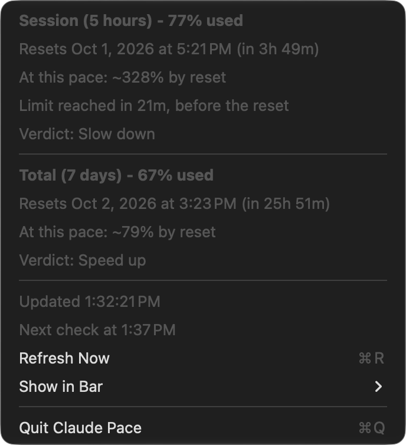
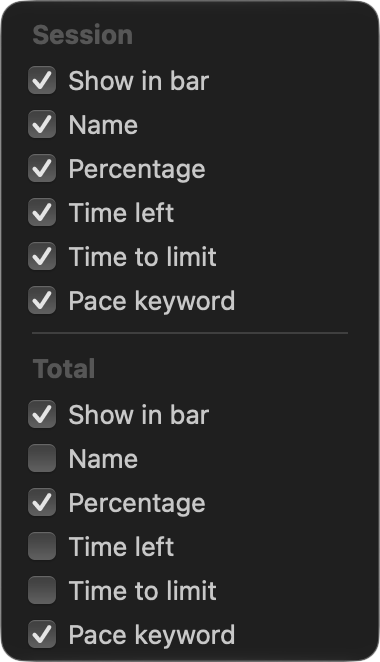

# Claude Pace

A macOS menu bar app that shows how your Claude Code usage limits are doing, and, more usefully, **whether you are burning through them too fast, at the right speed, or have room to spare.**

<p align="center">
  <picture>
    <source media="(prefers-color-scheme: dark)" srcset="docs/images/bar-default-dark.png">
    
  </picture>
</p>

Claude Code has two limits: a **5-hour session** window and a **7-day total** window. Knowing that you have used 77% of the session is half the story. What you want to know is *will this last until it resets?* Claude Pace answers that by projecting your current rate forward and putting a plain word next to each number: **Slow down**, **On pace**, **Speed up**, **Full send**.

- Live **percentage used** and **time left** for both windows, in the menu bar.
- A **pace keyword** per window, colour-coded, computed from how fast you are actually using the limit.
- An optional **time to limit**: "at this pace you hit the limit in 2h 22m", so you can judge whether that matters before your day ends.
- **Everything is optional and per window.** Show only the keyword, only the percentage, only Session, drop the window name: every combination is a checkbox. [See all combinations.](#all-combinations)
- Small and native: no Dock icon, well under 1 MB, written in Swift.
- **Private by design.** It talks to one Anthropic endpoint, stores only percentages on your Mac, and sends nothing anywhere else. [Details.](#privacy-and-security)

> **Not affiliated with Anthropic.** This is an independent tool. See the [disclaimer](#disclaimer): it relies on an unofficial, undocumented endpoint that can change without notice.

## Contents

- [Install](#install)
- [First launch](#first-launch)
- [Reading the bar](#reading-the-bar)
- [The dropdown](#the-dropdown)
- [Customizing the bar](#customizing-the-bar)
- [Rate limits and polling](#rate-limits-and-polling)
- [Privacy and security](#privacy-and-security)
- [Command-line options](#command-line-options)
- [Troubleshooting](#troubleshooting)
- [Uninstall and reset](#uninstall-and-reset)
- [How it works](#how-it-works)
- [Development](#development)
- [Disclaimer](#disclaimer)
- [License](#license)

## Install

**Requirements:** macOS 14 (Sonoma) or later, and [Claude Code](https://claude.com/claude-code) signed in on the same Mac with a Claude subscription (the plans that have the 5-hour and weekly usage windows).

### Option 1: Download the app

1. Download `ClaudePace-<version>.zip` from the [latest release](https://github.com/huseyiniyibas/claude-pace/releases/latest). It is a universal build: it runs natively on Apple Silicon and Intel.
2. *(Optional)* Check the download against the `.sha256` file from the same release:
   ```sh
   shasum -a 256 -c ClaudePace-<version>.zip.sha256
   ```
3. Unzip it and drag **ClaudePace.app** to your **Applications** folder.
4. The first time you open it, macOS will say it cannot verify the app. That is expected: the app is signed ad hoc and is **not notarized**, because notarization needs a paid Apple Developer membership. To open it anyway, use one of these:
   - **System Settings → Privacy & Security**, scroll down to the message about ClaudePace and click **Open Anyway**; or
   - in Terminal: `xattr -dr com.apple.quarantine /Applications/ClaudePace.app`

If you would rather not bypass that warning, build it yourself: an app you build on your own Mac is not quarantined, so there is no warning at all.

### Option 2: Build from source

You need Xcode 16 or later (or a Swift 6 toolchain).

```sh
git clone https://github.com/huseyiniyibas/claude-pace.git
cd claude-pace
./scripts/make-app.sh          # builds dist/ClaudePace.app for this Mac
open dist/ClaudePace.app
```

Copy `dist/ClaudePace.app` to `/Applications` if you want to keep it.

### Start at login

**System Settings → General → Login Items & Extensions**, click **+**, and choose ClaudePace.

## First launch

On the first launch macOS asks whether `security` may use the item **"Claude Code-credentials"** in your Keychain. Choose **Always Allow**.

That prompt is how Claude Pace reads the sign-in that Claude Code already stored, so it can ask Anthropic for your usage numbers. See [Privacy and security](#privacy-and-security) for exactly what is read and what is done with it. The prompt comes from the system `security` tool rather than from Claude Pace itself, which is deliberate: "Always Allow" then survives rebuilding or updating the app.

A few seconds later the bar fills in. Until then it shows `Pace …`. If something is wrong it shows `Pace ⚠︎`; open the menu to read the message.

## Reading the bar

A segment in the bar looks like this, here with every detail switched on (time to limit is off by default):

```text
Session 77% - 3h 49m left - limit in 21m | Slow down
└──┬──┘ └┬┘   └────┬────┘   └─────┬────┘   └───┬───┘
 name percent  time left    time to limit pace keyword
```

- **Session** is the 5-hour window. **Total** is the 7-day window.
- **Percentage** is how much of that limit you have used.
- **Time left** is how long until that window resets.
- **Time to limit** is how long until you would hit the limit if you keep going at this pace. It only appears while you are on course to hit the limit before the window resets, and it is off by default.
- **Pace keyword** says what your current rate means for the rest of the window.

Each of these can be switched on or off for each window; see [Customizing the bar](#customizing-the-bar).

Both windows are drawn side by side, each with its own keyword, because the two limits are independent: you can be running hot on the session and have plenty of the week left.

### The pace keywords

| Keyword | Projected usage at reset | Colour | What it means |
|---|---|---|---|
| **Slow down** | above 105% | red | At this pace you run out before the window resets. |
| **On pace** | 90% to 105% | green | You will land right around the limit as it resets. |
| **Speed up** | 65% to 90% | teal | You are using it slower than the window allows. There is room to spare. |
| **Full send** | below 65% | blue | A lot will go unused. Use it freely. |
| **Limit hit** | 100% used | red | You are at the limit. |
| **Warming up** | n/a | grey | The window just started (first 2%) and little is used (under 20%), so it is too early to tell. |

"Slow down" and "Full send" are about pace, not about how much you have left. A window at 90% that is nearly over can read **On pace**, while a window at 30% that has barely started can read **Slow down**.

### How the pace is worked out

For each window:

1. **Elapsed share** = (window length − time left) ÷ window length.
2. **Average rate** = percent used ÷ time elapsed, since the window began.
3. **Recent rate** = how fast the percentage has moved over roughly the last tenth of the window (about 30 minutes for Session, about 17 hours for Total), measured from the app's own readings. It needs a few readings to exist, so it is absent for the first minutes after the app starts.
4. **Rate** = the average of the average rate and the recent rate (or just the average rate while there is no recent one). Averaging the two keeps one idle hour, or one burst, from swinging the verdict.
5. **Projected usage at reset** = used + rate × time left.

The keyword comes from that projection using the bands in the table above. **Time to limit** is (100 − used) ÷ rate, shown only when it is shorter than the time left, i.e. when you would hit the limit before the reset.

Worked example, from the numbers used throughout this README:

| | Session | Total |
|---|---|---|
| Used | 77% | 67% |
| Time left | 3h 49m of 5h | 25h 51m of 7 days |
| Elapsed | 1h 11m | 142h 9m |
| Rate | about 1.08 points a minute | about 0.47 points an hour |
| Projected at reset | about 325% | about 79% |
| Time to limit | about 21 minutes | not reached |
| Keyword | **Slow down** | **Speed up** |

(The demo behind the screenshots counts from 3h 49m 30s, so its dropdown shows about 328% where the exact figure above is 325%. The maths is the same.)

## The dropdown

Click the bar item to open the dropdown. It always shows both windows in full, whatever the bar is set to show.

<p align="center">
  
</p>

| Line | What it tells you |
|---|---|
| **Session (5 hours) - 77% used** | The window and how much of it you have used. Same for **Total (7 days)**. |
| **Resets Oct 1, 2026 at 5:21 PM (in 3h 49m)** | When the window resets, and how long that is from now. |
| **At this pace: ~328% by reset** | Where you would end up at the reset if you kept going at the current rate. This is the number the keyword is based on. |
| **Limit reached in 21m, before the reset** | Only shown when you would hit 100% before the window resets. Counted at your current rate. |
| **Verdict: Slow down** | The pace keyword, the same one the bar uses. |
| **Sonnet, 7 days / Opus, 7 days** | Per-model weekly usage, when your account reports it. |
| **Updated 1:32:21 PM** | When the numbers were last fetched. If something went wrong, the problem is shown here instead. |
| **Next check at 1:37 PM** | When the app will ask again. |
| **Refresh Now** (⌘R) | Ask now. It is unavailable for 2 minutes after any check, and while the endpoint is rate limiting, to keep the app from making the problem worse. |
| **Show in Bar** | Choose what the bar shows. [See below.](#customizing-the-bar) |
| **Quit Claude Pace** (⌘Q) | Quit. |

When the numbers are out of date because of a problem, the bar is dimmed and the dropdown says why.

## Customizing the bar

Open **Show in Bar** in the dropdown. There is a group of checkboxes for **Session** and another for **Total**, and each window is set up on its own.

<p align="center">
  
</p>

For each window:

| Checkbox | What it does |
|---|---|
| **Show in bar** | Show this window in the bar, or hide it completely. |
| **Name** | Start the segment with "Session" or "Total". |
| **Percentage** | Show how much of the limit is used: `77%`. |
| **Time left** | Show time until the reset: `3h 49m left`. |
| **Time to limit** | Show time until you hit the limit at this pace: `limit in 21m`. Off by default. Shown only while you are on course to hit the limit before the reset. |
| **Pace keyword** | Show the coloured keyword: `Slow down`. |

The menu **stays open while you tick boxes**, so you can watch the bar change as you go. Click anywhere else to close it. Your choices are remembered.

Rules, so the bar can never end up empty:

- At least one window stays shown. When only one is left, its **Show in bar** box is greyed out.
- At least one of Percentage, Time left, Time to limit and Pace keyword stays ticked for each window. The last one is greyed out.
- A window you hide keeps its other settings for when you bring it back.
- If the chosen details have nothing to show (for example Time to limit alone, when you are not on course to hit the limit), the bar shows the percentage rather than a bare name.

How a segment is put together: the name comes first, then the chosen details joined with ` - `, and the keyword last after a ` | `. With no name and no other details, the keyword stands alone with no divider.

One thing to be aware of: with both windows shown and both names off, the bar does not say which is which (`Slow down   Speed up`). That is allowed, because the choice is yours. To show a single keyword, hide the other window.

### Examples

These images are drawn by the app itself from demo numbers (Session 77%, 3h 49m left; Total 67%, 25h 51m left), in light and dark.

<details open>
<summary><b>Gallery</b></summary>

**Default.** Everything on except time to limit.
<p><picture>
  <source media="(prefers-color-scheme: dark)" srcset="docs/images/bar-default-dark.png">
  
</picture></p>

**Percentage only.**
<p><picture>
  <source media="(prefers-color-scheme: dark)" srcset="docs/images/bar-percentage-dark.png">
  
</picture></p>

**Keyword only, names on.**
<p><picture>
  <source media="(prefers-color-scheme: dark)" srcset="docs/images/bar-keyword-dark.png">
  
</picture></p>

**Keyword only, names off.** The shortest bar.
<p><picture>
  <source media="(prefers-color-scheme: dark)" srcset="docs/images/bar-keywords-only-dark.png">
  
</picture></p>

**Names off, everything else on.**
<p><picture>
  <source media="(prefers-color-scheme: dark)" srcset="docs/images/bar-no-names-dark.png">
  
</picture></p>

**Session only.**
<p><picture>
  <source media="(prefers-color-scheme: dark)" srcset="docs/images/bar-session-only-dark.png">
  
</picture></p>

**With time to limit on Session.** At 77% after 1h 11m, you would hit the limit in about 21 minutes. Total is not on course to hit its limit, so it has nothing extra.
<p><picture>
  <source media="(prefers-color-scheme: dark)" srcset="docs/images/bar-time-to-limit-dark.png">
  
</picture></p>

**Different settings per window.** Session is just the keyword, Total has its name, percentage and time.
<p><picture>
  <source media="(prefers-color-scheme: dark)" srcset="docs/images/bar-mixed-dark.png">
  
</picture></p>

</details>

### All combinations

Every combination of **Name**, **Percentage**, **Time left** and **Pace keyword** is below, as plain text, with the numbers from above. For each choice of details there are three lines: what the Session segment looks like, what the Total segment looks like, and the bar when both windows use that choice. These examples are generated from the app's own code and checked by the test suite, so they match what the app shows.

<!-- examples:start -->

#### Window name on

Percentage, Time left and Pace keyword in every combination, with the window's name in front.

```text
Percentage
  Session  Session 77%
  Total    Total 67%
  Both     Session 77%   Total 67%

Time left
  Session  Session 3h 49m left
  Total    Total 25h 51m left
  Both     Session 3h 49m left   Total 25h 51m left

Pace keyword
  Session  Session | Slow down
  Total    Total | Speed up
  Both     Session | Slow down   Total | Speed up

Percentage + Time left
  Session  Session 77% - 3h 49m left
  Total    Total 67% - 25h 51m left
  Both     Session 77% - 3h 49m left   Total 67% - 25h 51m left

Percentage + Pace keyword
  Session  Session 77% | Slow down
  Total    Total 67% | Speed up
  Both     Session 77% | Slow down   Total 67% | Speed up

Time left + Pace keyword
  Session  Session 3h 49m left | Slow down
  Total    Total 25h 51m left | Speed up
  Both     Session 3h 49m left | Slow down   Total 25h 51m left | Speed up

Percentage + Time left + Pace keyword
  Session  Session 77% - 3h 49m left | Slow down
  Total    Total 67% - 25h 51m left | Speed up
  Both     Session 77% - 3h 49m left | Slow down   Total 67% - 25h 51m left | Speed up
```

#### Window name off

The same combinations without the name.

```text
Percentage
  Session  77%
  Total    67%
  Both     77%   67%

Time left
  Session  3h 49m left
  Total    25h 51m left
  Both     3h 49m left   25h 51m left

Pace keyword
  Session  Slow down
  Total    Speed up
  Both     Slow down   Speed up

Percentage + Time left
  Session  77% - 3h 49m left
  Total    67% - 25h 51m left
  Both     77% - 3h 49m left   67% - 25h 51m left

Percentage + Pace keyword
  Session  77% | Slow down
  Total    67% | Speed up
  Both     77% | Slow down   67% | Speed up

Time left + Pace keyword
  Session  3h 49m left | Slow down
  Total    25h 51m left | Speed up
  Both     3h 49m left | Slow down   25h 51m left | Speed up

Percentage + Time left + Pace keyword
  Session  77% - 3h 49m left | Slow down
  Total    67% - 25h 51m left | Speed up
  Both     77% - 3h 49m left | Slow down   67% - 25h 51m left | Speed up
```

#### With Time to limit

Time to limit is switched off by default. Here it is added to every combination, with the name on. It only appears while the limit would be reached before the window resets, which is the case for Session in these numbers and not for Total, so Total shows nothing extra. If Time to limit is the only detail chosen and does not apply, the bar shows the percentage instead of nothing.

```text
Time to limit
  Session  Session limit in 21m
  Total    Total 67%
  Both     Session limit in 21m   Total 67%

Percentage + Time to limit
  Session  Session 77% - limit in 21m
  Total    Total 67%
  Both     Session 77% - limit in 21m   Total 67%

Time left + Time to limit
  Session  Session 3h 49m left - limit in 21m
  Total    Total 25h 51m left
  Both     Session 3h 49m left - limit in 21m   Total 25h 51m left

Time to limit + Pace keyword
  Session  Session limit in 21m | Slow down
  Total    Total | Speed up
  Both     Session limit in 21m | Slow down   Total | Speed up

Percentage + Time left + Time to limit
  Session  Session 77% - 3h 49m left - limit in 21m
  Total    Total 67% - 25h 51m left
  Both     Session 77% - 3h 49m left - limit in 21m   Total 67% - 25h 51m left

Percentage + Time to limit + Pace keyword
  Session  Session 77% - limit in 21m | Slow down
  Total    Total 67% | Speed up
  Both     Session 77% - limit in 21m | Slow down   Total 67% | Speed up

Time left + Time to limit + Pace keyword
  Session  Session 3h 49m left - limit in 21m | Slow down
  Total    Total 25h 51m left | Speed up
  Both     Session 3h 49m left - limit in 21m | Slow down   Total 25h 51m left | Speed up

Percentage + Time left + Time to limit + Pace keyword
  Session  Session 77% - 3h 49m left - limit in 21m | Slow down
  Total    Total 67% - 25h 51m left | Speed up
  Both     Session 77% - 3h 49m left - limit in 21m | Slow down   Total 67% - 25h 51m left | Speed up
```

#### Different settings per window

Each window has its own settings, so the two can be set up differently in the same bar.

```text
Session: keyword only, no name.  Total: name, percentage, time left.
  Slow down   Total 67% - 25h 51m left

Session: name, percentage, time to limit.  Total: hidden.
  Session 77% - limit in 21m

Session: hidden.  Total: keyword only, no name.
  Speed up

Session: percentage and keyword, no name.  Total: name and keyword.
  77% | Slow down   Total | Speed up

Both windows: no names, keyword only.
  Slow down   Speed up
```

<!-- examples:end -->

## Rate limits and polling

The usage endpoint is not a public API and is strict about how often it is called, so Claude Pace is careful:

- It checks **once every 5 minutes**. The percentages move slowly, and the countdowns and keywords are recalculated on your Mac every 30 seconds in between, so the bar stays current without asking.
- If the endpoint answers *rate limited*, it waits longer each time: **5, 10, 20, then 30 minutes**. If the server says how long to wait, it waits at least that long (never more than an hour).
- Other problems wait less: network trouble or a server error retry after 2 minutes, and sign-in problems after 5.
- The last reading and the schedule are **saved to disk**. Quitting and reopening the app does not spend a request: it shows the saved numbers straight away and keeps to the saved schedule. A saved reading older than 30 minutes is not shown.
- **Refresh Now** is closed for 2 minutes after any check, and for as long as the endpoint is rate limiting.

At the normal pace that is 12 requests an hour.

> If you run another tool that polls the same endpoint with the same Claude Code sign-in, the two may draw on the same request budget. If you see rate-limit messages while another usage monitor is running, try quitting the other one.

## Privacy and security

This app handles a credential, so here is exactly what it does. The relevant code is small and in the open: [`OAuthLimitsProvider.swift`](Sources/ClaudePaceCore/OAuthLimitsProvider.swift).

**What it reads**

- The Claude Code sign-in from your macOS Keychain, by running `/usr/bin/security find-generic-password -s "Claude Code-credentials" -w`. If that is not there it looks for `~/.claude/.credentials.json`.
- From that it uses **only the access token and its expiry time**. The refresh token is never read or used. If the access token has expired, the app does not refresh it; it asks you to use Claude Code once and waits. (Refreshing could rotate the token and sign Claude Code itself out.)
- The `~/.claude/projects` transcripts are **not** read.

**What it sends**

- One HTTPS `GET` to `https://api.anthropic.com/api/oauth/usage` per check, with your access token in the `Authorization` header. That is the same request Claude Code's own usage screen makes.
- Nothing else. **No other network connection is made.** No telemetry, no analytics, no crash reporting, no update check.

**What it keeps**

- The token is held in memory for the length of one request. It is never written to disk, never logged, and never printed (not even by `--print --raw`, which prints only the usage numbers the endpoint returns).
- On disk, in `~/Library/Application Support/ClaudePace/`: `state.json` (the last reading's percentages and reset times, and the polling schedule) and `samples.json` (a history of percentages and timestamps, kept for 8 days, used for the recent-rate estimate). No tokens, no prompts, no project names.
- Your Show in Bar choices, in the app's preferences (`com.claudepace.app`).

You can check all of this yourself: the app's only network access is the one request above (a tool such as Little Snitch or `nettop` will show it), and the sources are here.

## Command-line options

Run the binary inside the app, or use `swift run ClaudePace` from a clone:

```sh
/Applications/ClaudePace.app/Contents/MacOS/ClaudePace --print        # fetch once, print the bar text, exit
/Applications/ClaudePace.app/Contents/MacOS/ClaudePace --print --raw  # also print the endpoint's raw JSON
/Applications/ClaudePace.app/Contents/MacOS/ClaudePace --demo         # run with fixed demo numbers
```

| Option | What it does |
|---|---|
| `--print` | Fetches your usage once, prints the bar text, and exits. A quick way to check the live data path. Needs the same Keychain access as the app. It spends one request, so do not run it in a loop. |
| `--print --raw` | Also prints the endpoint's raw JSON response, which contains usage numbers only. Useful for bug reports. |
| `--demo` | Runs the menu bar app with fixed numbers (Session 77%, Total 67%). No sign-in is needed, and nothing is read from or saved to your Mac, including your settings. |

A few more flags exist for generating the images in this README; see [Development](#development).

## Troubleshooting

**The bar shows `Pace …`.** It is waiting for the first reading, which takes a few seconds. If it stays, open the menu to see why.

**The bar shows `Pace ⚠︎`, or is dimmed.** Open the menu: the message there says what is wrong.

**"No Claude Code sign-in found."** Run `claude` in a terminal and sign in, and allow the Keychain prompt. If you clicked *Deny* earlier, quit and reopen Claude Pace; the prompt should appear again.

**"Claude Code's sign-in has expired."** Use Claude Code once and it refreshes the sign-in itself. Claude Pace does not refresh it for you, on purpose.

**"The usage endpoint is rate limiting requests."** The numbers shown are the last good reading, dimmed. The app retries on its own, waiting longer each time. If you are running another usage monitor, try quitting it. See [Rate limits and polling](#rate-limits-and-polling).

**I do not see it in the menu bar.** On a Mac with a notch, macOS hides menu bar items that do not fit, and the full bar is long. Close some other menu bar apps, or shorten the bar with **Show in Bar** (for example, keyword only, or hide one window).

**macOS says the app cannot be opened or "is damaged".** See [step 4 of the install](#option-1-download-the-app). That is the quarantine flag on a downloaded, un-notarized app: `xattr -dr com.apple.quarantine /Applications/ClaudePace.app` clears it.

**The numbers differ from Claude Code's `/usage`.** They come from the same endpoint but are up to 5 minutes old by design.

**The Keychain prompt keeps coming back.** Make sure you chose *Always Allow* rather than *Allow*.

## Uninstall and reset

To uninstall: quit the app, delete `ClaudePace.app`, and remove it from **Login Items** if you added it. To remove everything it stored:

```sh
rm -rf ~/Library/Application\ Support/ClaudePace
defaults delete com.claudepace.app
```

To only reset your Show in Bar choices to the defaults: quit the app, then `defaults delete com.claudepace.app barOptions`.

## How it works

1. Every 5 minutes it asks Anthropic's usage endpoint for the percentage used and the reset time of each window.
2. It records each reading in a small local history so it can measure how fast you are going lately.
3. For each window it projects usage to the reset, picks a keyword, and draws the bar from your Show in Bar settings. It redraws every 30 seconds so the countdowns stay current between checks.

Project layout:

```text
Sources/
  ClaudePaceCore/            Everything that is not on-screen. No UI code, fully tested.
    Pace.swift                 The windows, the keywords and the projection maths.
    UsageModels.swift          Reading the endpoint's JSON, and the error cases.
    UsageReport.swift          Turns a reading into bar segments.
    BarOptions.swift           The per-window Show in Bar settings, and saving them.
    DurationFormat.swift       "3h 49m", "25h 51m", "<1m".
    SampleHistory.swift        The local history behind the recent-rate estimate.
    Polling.swift              When to ask next, and what survives a restart.
    OAuthLimitsProvider.swift  Keychain, the one network request, and a demo provider.
  ClaudePace/                The app: menu bar item, dropdown and the Show in Bar menu.
Tests/                       Swift Testing suites for the core and for the menu.
scripts/                     make-app.sh, release.sh, screenshots.sh.
docs/images/                 The pictures in this README.
```

## Development

```sh
swift build                    # debug build
swift test                     # the whole test suite
swift run ClaudePace --demo    # try it with fixed numbers, no sign-in needed
./scripts/make-app.sh          # dist/ClaudePace.app for this Mac
./scripts/release.sh 0.1.0     # universal app, zipped with a SHA-256, in dist/
```

The bar examples in this README are generated from the code and checked by a test. After changing how the bar reads, refresh them with:

```sh
UPDATE_README=1 swift test --filter ReadmeExamples
```

The images in `docs/images` come from `scripts/screenshots.sh`. The bar images are drawn offscreen by the app itself (`--render-bar`), so they always match the real drawing code. The two menu images are real captures of the app's own menu windows, and only those windows, taken in demo mode; the script needs Screen Recording permission for your terminal and briefly opens a menu on screen. Run `scripts/screenshots.sh --bars-only` to skip the captures. The developer flags involved (`--screenshot`, `--open-menu`, `--open-options`, `--render-bar`, `--light`, `--dark`, and the `CLAUDEPACE_OPTIONS` environment variable) work only together with `--demo`.

## Disclaimer

Claude Pace is an independent project. It is not affiliated with, endorsed by, or sponsored by Anthropic. "Claude" and "Claude Code" are trademarks of Anthropic.

It relies on an **unofficial, undocumented endpoint** that Claude Code uses for its own usage screen. Anthropic can change or remove it at any time, which would break this app until it is updated. If the endpoint answers in a shape the app does not understand, the app says so instead of showing wrong numbers.

The pace keywords are estimates from a straight-line projection of recent usage. They are a guide, not a guarantee: a burst of activity or a quiet spell changes them.

## License

[MIT](LICENSE).
